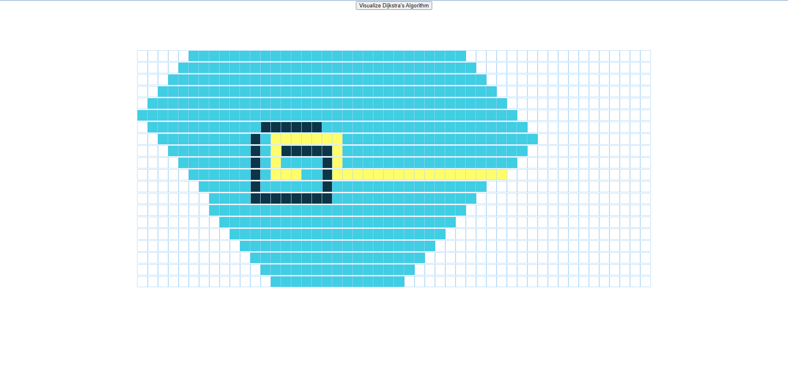
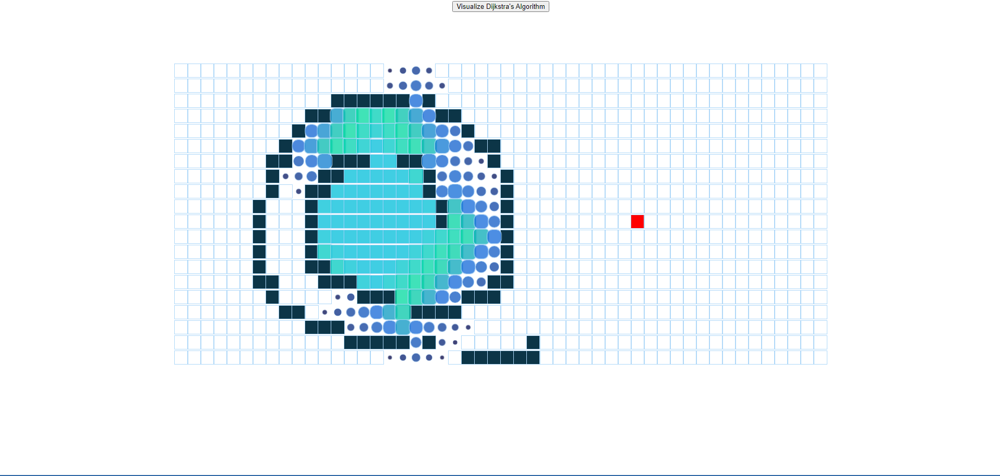

Built this project as a path of a tutorial.

This project was bootstrapped with [Create React App](https://github.com/facebook/create-react-app).

To Run the project: cd to project folder and type npm start and npm run.
<ul>
<li>This project Visually demonstrates dijkstra algorithm technique to find the shortest path between starting and ending points.
  <li>A 20*50 grid is displayed with a starting position and an ending position
 <li>You can Hold mouse button to create walls anywhere between the grids
 <li>then press the visualize button to see the algorithm in action
</ul>

